<p align="center">
  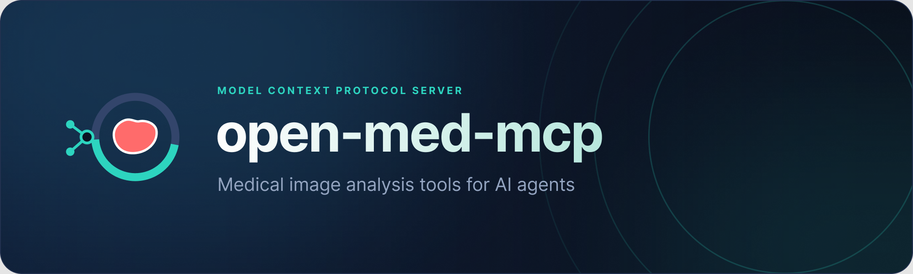
</p>

<p align="center">
  <a href="https://github.com/d0ng231/open-med-mcp/actions/workflows/ci.yml"></a>
  <a href="LICENSE"></a>
  
  
  
  
</p>

<p align="center">
  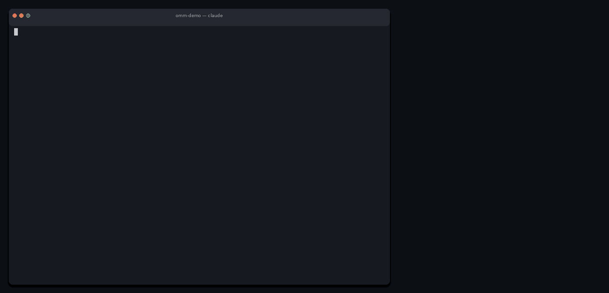
</p>

<p align="center"><em>A real Claude Code session driving open-med-mcp, recorded live — the terminal on the left, the viewer window popping out on the right to show each render the moment its tool produces it. Three worked examples: a <b>chest CT</b> (three-plane view + a Hounsfield bone montage), a <b>chest X-ray</b> (multi-organ segmentation + finding classification), and a <b>brain MRI</b>. Every number, path and image is genuine tool output.</em></p>

**open-med-mcp** — **OMM** (Open Medical MCP; hence the `OMM_*` settings) — is an open, modular
[Model Context Protocol](https://modelcontextprotocol.io) server that lets AI coding agents (Claude
Code, Codex CLI, Claude Desktop, Cursor, ...) do **end-to-end medical image analysis** on your
machine: inspect a CT/MRI/X-ray, pick a protocol, run a segmentation model, *look* at the result,
refine it, measure it, and write a report.

It goes beyond segmentation - classification, detection, vision-language questions, radiomics, and
computable clinical criteria (RECIST 1.1, Fleischner, Lung-RADS, LI-RADS, TI-RADS, Agatston) with
the matching guidelines - and is built on three pillars:

| pillar | what it means |
|---|---|
| **1. Containerized specialised models** | Every model is an *adapter* with a manifest, a `run.py` and a Dockerfile, speaking one tiny job-directory contract. Run it locally (pip extra), in Docker (GHCR images) or in Apptainer on an HPC cluster - the agent does not care which. Ships with **MedSAM2**, **SAM 2.1**, **VoxTell** (free-text prompts), **TotalSegmentator**, **lungmask**, **HD-BET**, **SynthStrip** (official FreeSurfer image), **nnU-Net** (any trained model), **MONAI Model Zoo bundles**, **TorchXRayVision** and a classical baseline; adding your own model is a folder with three files, and existing third-party images can be wrapped with a command template. |
| **2. Preset / custom guidelines** | Markdown protocols with YAML front matter that tell an agent *how* to do a task well (which model, which window, what to check, what to report). Presets ship with the package; drop your own into a folder to override or extend them. They are exposed as MCP prompts and resources. |
| **3. Modular, code-customizable viewer** | Agents see: `render_view` returns PNGs (single slice, three planes, montage) with native voxel coordinate grids so prompts can be read off the picture. Humans see: a self-contained, **interactive** HTML viewer (cine through slices, toggle the overlay, zoom, click/drag to get point/box prompts with a millimetre size), Markdown/HTML reports and an optional NiiVue 3D page. Renderers are pluggable. |

Everything is local. Images never leave the machine.

<p align="center">
  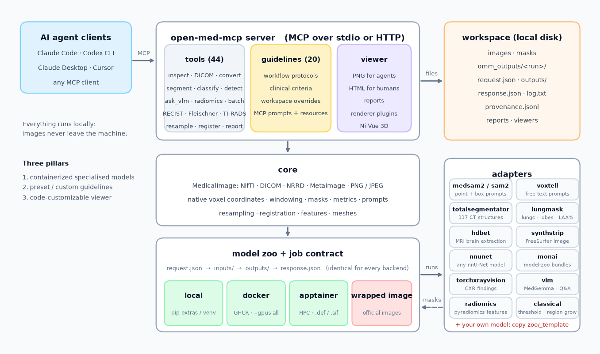
</p>

## Quick start

```bash
# 1. install (Python 3.10+)
pip install "open-med-mcp @ git+https://github.com/d0ng231/open-med-mcp"
#    optional local model backends (or use containers, see below):
pip install "open-med-mcp[sam2,totalsegmentator] @ git+https://github.com/d0ng231/open-med-mcp"   # pick extras: sam2,
#    totalsegmentator, lungmask, hdbet, nnunet, monai, torchxrayvision  -  or [models] for all

# 2. check the environment and fetch weights you want to use
open-med-mcp doctor
open-med-mcp models download medsam2

# 3. register the server with your agent (run inside the folder that holds your images)
claude mcp add open-med-mcp -e OMM_WORKSPACE=$PWD -- open-med-mcp serve      # Claude Code
codex mcp add open-med-mcp --env OMM_WORKSPACE=$PWD -- open-med-mcp serve    # Codex CLI
open-med-mcp client-config claude-desktop                                    # prints JSON for other clients
```

Then talk to your agent:

> *"Segment the liver in `ct.nii.gz`, check the result in three planes, and give me the volume."*

A typical run looks like this (tool calls made by the agent):

```text
get_conventions()                               -> coordinate + prompt conventions
inspect_image("ct.nii.gz")                      -> 512x512x210, 0.8x0.8x1.5 mm, CT, RAS, preview
get_guideline("segmentation-3d-ct")             -> protocol: TotalSegmentator first, MedSAM2 to refine
run_model("totalsegmentator", {"image": "ct.nii.gz"}, params={"roi_subset": ["liver"]})
render_view("ct.nii.gz", masks=[mask], layout="three-plane", window="soft-tissue")   -> PNG (agent looks)
mask_to_prompts(mask)                           -> box prompt for a promptable model
segment("ct.nii.gz", model="medsam2", prompts=[{"type": "box", "coords": [...], "slice": 97}])
compare_masks(ts_mask, medsam2_mask, image="ct.nii.gz")   -> Dice, HD95, volume difference
postprocess_mask(mask, ["largest_component", "fill_holes"])
mask_stats(mask, image="ct.nii.gz")            -> 1432 mL, mean 58 HU
write_report("Liver volumetry", sections=[...])
```

<p align="center">
  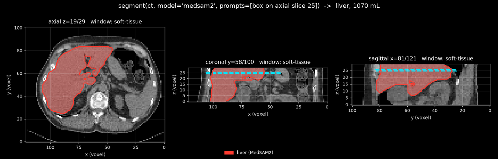<br>
  <em>What the agent sees after <code>segment(...)</code>: three planes, the mask, native-voxel tick labels.</em>
</p>

## Tools

| group | tools |
|---|---|
| **inspect** | `inspect_image` (geometry, orientation, planes, statistics, modality guess, preview), `list_workspace`, `list_dicom_series`, `convert_image` |
| **models** | `list_models`, `describe_model`, `download_weights`, `segment` (promptable or automatic), `run_model` (any model/task), `classify_image`, `detect`, `ask_vlm`, `run_batch` (cohorts -> CSV), `get_job` / `list_jobs` (background runs) |
| **clinical criteria** | `measure_lesion` + `recist_response` (RECIST 1.1), `fleischner_recommendation` (2017), `tirads_score` (ACR TI-RADS), `agatston_score` (coronary calcium), `cardiothoracic_ratio`, `future_liver_remnant`, `mayo_adpkd_class` |
| **masks** | `mask_stats` (volumes, bboxes, components, intensities), `postprocess_mask`, `compare_masks` (Dice, IoU, HD95, ASSD), `mask_to_prompts`, `combine_masks`, `mask_features` (shape + first-order radiomics), `mask_to_mesh` (STL/OBJ) |
| **processing** | `resample_image`, `reorient_image`, `crop_image`, `n4_bias_correction`, `register_images` (rigid / affine / B-spline), `apply_transform` |
| **viewer** | `render_view` (PNG the agent sees), `export_viewer` (HTML for humans), `write_report`, `list_renderers` |
| **guidance** | `list_guidelines`, `get_guideline`, `get_conventions` (+ MCP prompts and resources), `list_plugins` |

Full reference with every parameter: [docs/tools.md](docs/tools.md). Coordinate conventions: [docs/coordinates.md](docs/coordinates.md).

## Models

| model | what it does | modalities | prompts | how it runs |
|---|---|---|---|---|
| `medsam2` | MedSAM2: promptable 2D + 3D segmentation (slice propagation), medical fine-tune of SAM 2.1 | CT, MR, PET, US, endoscopy | box, points | local `[sam2]`, Docker, Apptainer |
| `sam2` | SAM 2.1 tiny / small / base+ / large | any | box, points | local `[sam2]`, Docker, Apptainer |
| `voxtell` | VoxTell (CVPR 2026): **free-text** prompts ("liver", "left kidney", "liver tumor") -> 3D masks | CT, MR, PET | text | local `[voxtell]`, Docker, Apptainer |
| `totalsegmentator` | 117 CT structures, MR variant, vessels, body regions ... | CT, MR | - | local `[totalsegmentator]`, Docker, Apptainer |
| `lungmask` | lungs (R231) and lobes (LTRCLobes) + LAA% emphysema index | CT | - | local `[lungmask]`, Docker, Apptainer |
| `hdbet` | HD-BET 2.0 brain extraction (mask + stripped image) | MR | - | local `[hdbet]`, Docker, Apptainer |
| `synthstrip` | FreeSurfer SynthStrip skull stripping, **official image wrapped** | MR, CT, PET | - | Docker, Apptainer (host `mri_synthstrip` if installed) |
| `nnunet` | any nnU-Net v2 model (results folder, exported zip, dataset name) | any | - | local `[nnunet]`, Docker, Apptainer |
| `monai` | MONAI Model Zoo bundles: segmentation (spleen, pancreas, whole body, BraTS, prostate ...) and detection (lung nodules, RetinaNet) | CT, MR | - | local `[monai]`, Docker, Apptainer |
| `torchxrayvision` | chest X-ray: 18-finding classification, 14-structure anatomy segmentation (-> cardiothoracic ratio), biological age | XR | - | local `[torchxrayvision]`, Docker, Apptainer |
| `vlm` | vision-language: MedGemma 4B by default (any HF image-text-to-text model, e.g. Qwen2.5-VL) - describe, answer, draft | any | text | local `[vlm]`, Docker, Apptainer |
| `radiomics` | pyradiomics: IBSI feature extraction (shape, first order, GLCM, GLRLM, GLSZM, GLDM, NGTDM, filters) per label | CT, MR, PET | - | local (Python 3.9 venv), Docker, Apptainer |
| `classical` | threshold / Otsu / multi-range / seeded region growing | any | seeds | local (no extras), Docker, Apptainer |

```bash
open-med-mcp models list                              # what is available
open-med-mcp models check hdbet                       # which backend can run it here
open-med-mcp models pull medsam2                      # docker pull ghcr.io/d0ng231/open-med-mcp-sam2:0.1
open-med-mcp models pull synthstrip --engine apptainer   # HPC: official image -> .sif
open-med-mcp models build lungmask --engine apptainer    # or build from the Dockerfile (converted to a .def)
open-med-mcp run lungmask --image chest_ct.nii.gz --task lobes
open-med-mcp run medsam2 --image ct.nii.gz --prompts '[{"type":"box","coords":[60,80,20,140,170,20]}]'
open-med-mcp run voxtell --image ct.nii.gz --prompts '[{"type":"text","text":"liver"},{"type":"text","text":"spleen"}]'
```

**Adding a model** = copy `src/open_med_mcp/zoo/_template/`, edit the manifest, implement `run.py`
against the [job contract](docs/models.md), add a Dockerfile. **Wrapping an existing image** (as
`synthstrip` does) needs only a manifest with a command template. User models can live outside the
package (`OMM_MODEL_DIRS`). See [docs/models.md](docs/models.md).

## Guidelines

Workflow presets: `getting-started`, `segmentation-3d-ct`, `segmentation-3d-mri`, `segmentation-2d-prompted`,
`brain-mri-preprocessing`, `chest-xray-triage`, `chest-xray-anatomy-and-ctr`, `lung-ct-analysis`,
`registration-followup`, `batch-processing`, `multi-organ-ct-report`, `compare-two-segmentations`, `qc-checklist`.

Clinical criteria presets (each cites its source and states its scope): `recist-1-1`, `fleischner-2017`,
`lung-rads-2022`, `li-rads-2018`, `acr-ti-rads-2017`, `coronary-calcium-agatston`,
`organ-volume-reference-ranges`.

Add your own: put `*.md` files with YAML front matter into `omm_guidelines/` in the workspace (or any
directory in `OMM_GUIDELINE_DIRS`). A file with the same `name` overrides the preset. Guidelines
are also exposed as MCP prompts (`/mcp__open-med-mcp__segmentation-3d-ct` in Claude Code) and as
`guideline://<name>` resources. See [docs/guidelines.md](docs/guidelines.md).

## Viewer

The viewer is **code, not screenshots**. `export_viewer` writes one self-contained HTML file - no
server, no CDN, no build step - that is genuinely interactive.

<p align="center">
  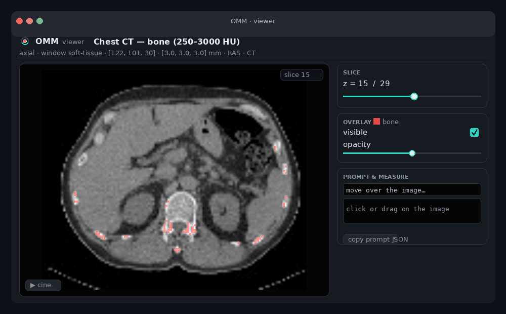
</p>

<p align="center"><b>▶ Try it live</b> in your browser (each is one self-contained file, nothing to install):<br>
<a href="https://htmlpreview.github.io/?https://github.com/d0ng231/open-med-mcp/blob/main/docs/examples/chest-ct-viewer.html">chest CT + bone mask (30 slices)</a> &nbsp;·&nbsp;
<a href="https://htmlpreview.github.io/?https://github.com/d0ng231/open-med-mcp/blob/main/docs/examples/chest-xray-viewer.html">chest X-ray, multi-organ overlay</a></p>

* `render_view(...)` - PNG figures the agent can look at; every panel carries native-voxel tick
  labels and the result reports which axis is on screen x/y.
* `export_viewer(...)` - one HTML file, no server, no CDN. **Interactive:** scroll or **cine** through
  slices, toggle the overlay and its opacity, **invert**, **zoom / pan**, and **click or drag on the
  image to read a native-voxel point or box prompt** (with a millimetre size) that feeds straight back
  into `segment` - one button copies the prompt JSON.
* `open-med-mcp serve-viewer ct.nii.gz -m mask.nii.gz` - interactive 3D (NiiVue) on localhost.
* `write_report(...)` - Markdown + HTML with embedded figures.
* Custom renderers: implement `render(image, masks, spec)`, register with `@register_renderer` or
  the `open_med_mcp.renderers` entry point, and pass `renderer="yourname"`. See [docs/viewer.md](docs/viewer.md).


## Gallery

| automatic anatomy: `run_model("totalsegmentator", ...)` | free-text prompts: `segment(ct, model="voxtell", prompts=[{"type": "text", "text": "liver"}, ...])` |
|---|---|
| 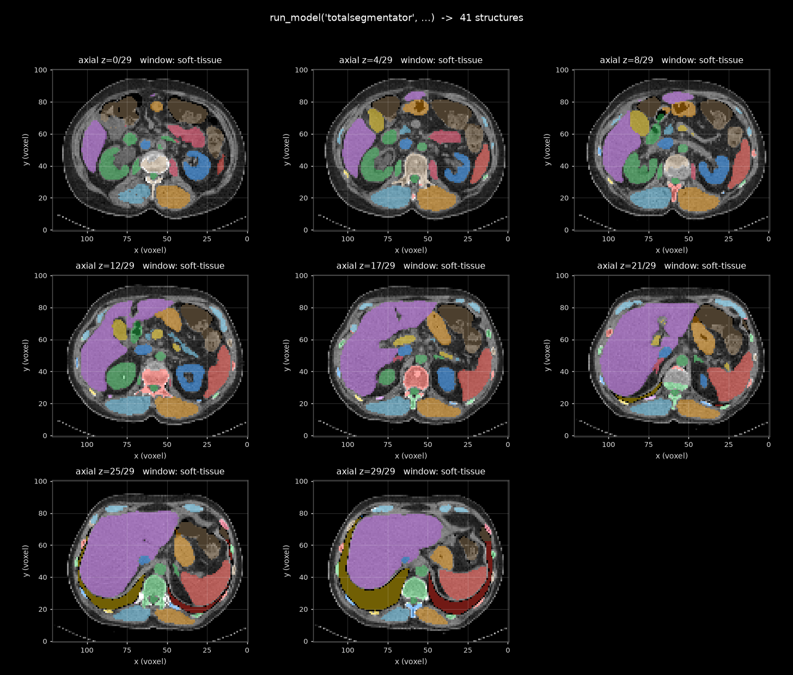 | 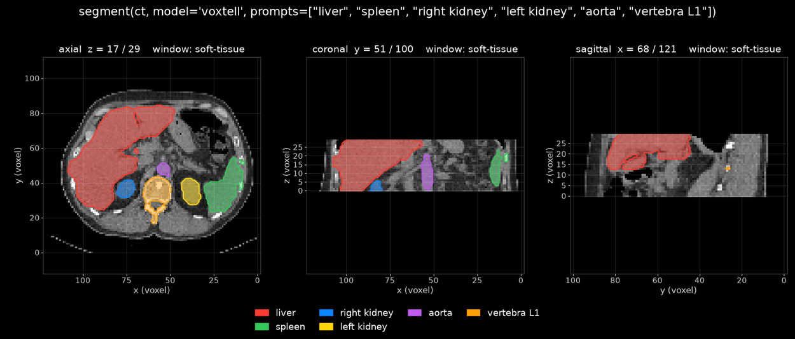 |
| **skull stripping: `run_model("hdbet", ...)` vs `synthstrip`** | **chest X-ray: `classify_image("cxr.png")`** |
| 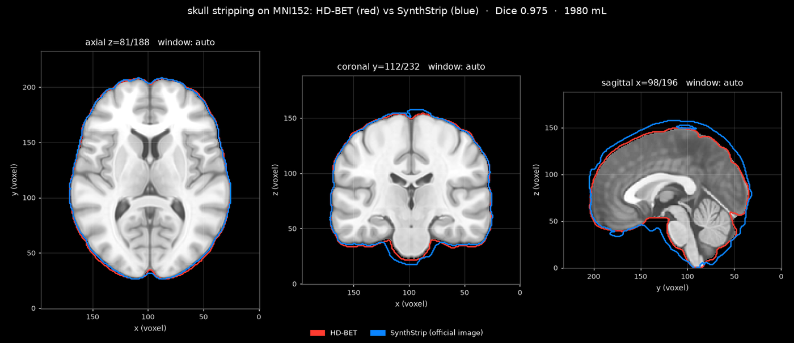 | 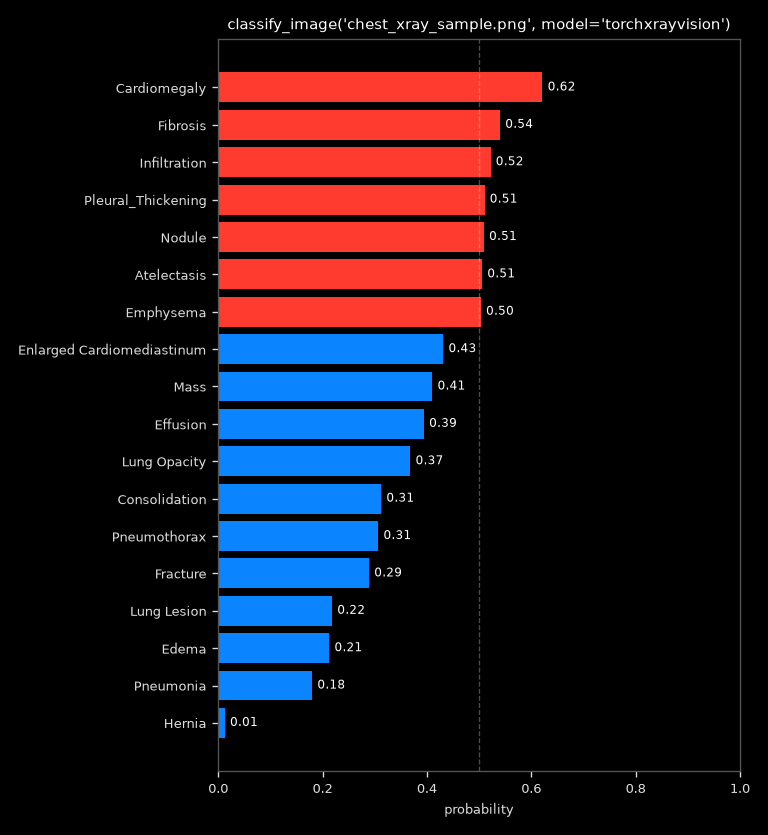 |
| **2D promptable: `segment("slice.png", model="medsam2", prompts=[box])`** | **agent QC view: `compare_masks(...)`** |
| 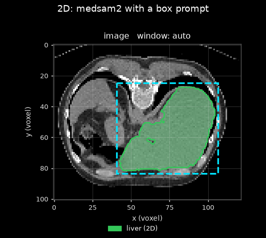 | 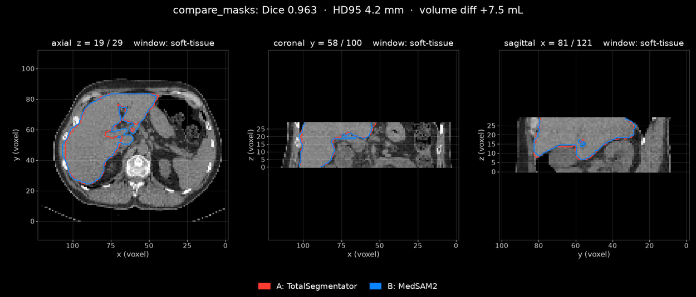 |
| **chest X-ray anatomy + `cardiothoracic_ratio(...)`** | **classify + measure + criteria** |
| 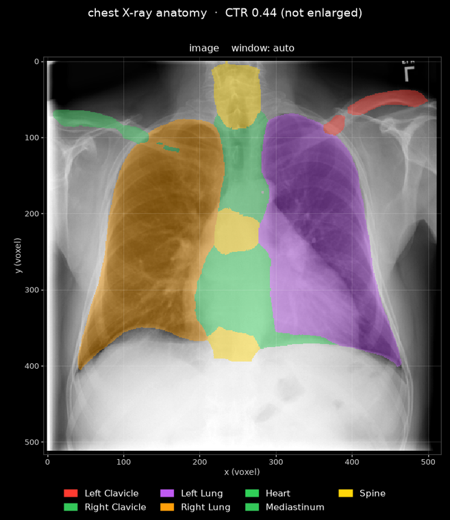 | RECIST `measure_lesion`/`recist_response`, Fleischner, TI-RADS, Agatston, `ask_vlm` (MedGemma), `run_model("radiomics", ...)` |

All figures on this page are real outputs of the tools on public sample data (a small abdominal CT,
the MNI152 template, a NIH chest X-ray); see `examples/get_sample_data.sh`. On that CT, VoxTell's
text prompts agree with TotalSegmentator at Dice 0.94 (liver), 0.91 (spleen, left kidney), 0.89
(right kidney, L1) and 0.81 (aorta).

## Plug in your own

Everything is extensible from the workspace, without forking:

```bash
open-med-mcp new plugin lesion-count     # omm_plugins/lesion_count.py: register(server) + your @server.tool()s
open-med-mcp new model my-unet           # omm_models/my-unet/: manifest + run.py + Dockerfile (job contract)
open-med-mcp new model synthseg --wrapped-image freesurfer/synthseg   # manifest only, drives the official image
open-med-mcp new guideline my-protocol   # omm_guidelines/my-protocol.md
open-med-mcp plugins list                # what loads, and why something did not
```

Plug-in tools use `open_med_mcp.plugin_api` (path resolution, cached image loading, previews,
result packaging) and appear next to the built-in tools; packaged plug-ins register through the
`open_med_mcp.plugins` entry point. See [docs/plugins.md](docs/plugins.md) and `examples/plugins/`.

## Running reliably in any MCP client

* **stdio hygiene** - the server never writes to stdout; logs go to stderr and `$OMM_HOME/logs/server.log`.
* **Long runs** - model tools stream MCP progress notifications; pass `wait=false` to get a job id
  immediately and poll `get_job` (results, previews and logs are also on disk under `omm_outputs/`).
* **Concurrency** - tools run in worker threads; rendering, caches and provenance are lock-protected.
* **Payload limits** - inline previews are capped (`OMM_MAX_IMAGE_BYTES`, default 1.5 MB) and can be
  switched off for text-only clients (`OMM_RETURN_IMAGES=0`); every result also names the saved file.
* **Transports** - `open-med-mcp serve` (stdio), `--transport streamable-http` / `sse` for remote
  agents; over HTTP file access is confined to the workspace by default.
* **Errors** - every tool returns a readable `is_error` result instead of crashing the session.
* **Schemas** - every parameter is typed and described; the test-suite validates all tool schemas.

## Configuration

| variable | default | meaning |
|---|---|---|
| `OMM_WORKSPACE` | current directory | root for relative paths; outputs go to `<workspace>/omm_outputs/` |
| `OMM_HOME` | `~/.cache/open-med-mcp` | weights and Apptainer images |
| `OMM_RUNNER` | `auto` | `local` / `docker` / `apptainer`; auto = local if importable, else docker, else apptainer |
| `OMM_DEVICE` | `auto` | `cpu`, `cuda`, `cuda:1` |
| `OMM_ZOO_<ADAPTER>_PYTHON` | current interpreter | interpreter of a dedicated venv for a local adapter (e.g. `OMM_ZOO_SAM2_PYTHON`) |
| `OMM_MODEL_DIRS`, `OMM_GUIDELINE_DIRS` | - | extra adapters / guidelines (`:`-separated) |
| `OMM_IMAGE_PREFIX` | `ghcr.io/d0ng231/open-med-mcp` | registry prefix for container images |
| `OMM_ALLOW_OUTSIDE_WORKSPACE` | `true` (stdio) / `false` (HTTP) | confine file access to the workspace |
| `OMM_PLUGIN_DIRS` | - | extra plug-in directories (`:`-separated) |
| `OMM_RETURN_IMAGES` | `true` | inline preview images in results |
| `OMM_MAX_IMAGE_BYTES` | `1500000` | cap for one inline image |
| `OMM_LOG_LEVEL`, `OMM_LOG_FILE` | `INFO`, `$OMM_HOME/logs/server.log` | logging |
| `OMM_CACHE_MB` | `1500` | in-memory image cache budget |

## HPC / SLURM

No Docker on the cluster? `open-med-mcp models pull <model> --engine apptainer` fetches the GHCR
image as a `.sif`, or `models build --engine apptainer` converts the Dockerfile to an Apptainer
definition and builds it. Set `OMM_RUNNER=apptainer`; GPU passthrough (`--nv`) is automatic when a
GPU is visible. Alternatively point `OMM_ZOO_SAM2_PYTHON` at a venv with PyTorch and run models on
a GPU node with the local backend. See [docs/hpc.md](docs/hpc.md).

## Documentation

* [Architecture](docs/architecture.md) - components, data flow, design decisions
* [Quick start and client setup](docs/quickstart.md) - Claude Code, Codex, Claude Desktop, Cursor, HTTP transport
* [Tool reference](docs/tools.md)
* [Coordinate and prompt conventions](docs/coordinates.md)
* [Models and the job contract](docs/models.md)
* [Guidelines](docs/guidelines.md)
* [Viewer](docs/viewer.md)
* [HPC](docs/hpc.md)
* [Plug-ins](docs/plugins.md) - tools, models, guidelines, renderers
* [Examples](examples/)

## Development

```bash
git clone https://github.com/d0ng231/open-med-mcp && cd open-med-mcp
uv venv && uv pip install -e ".[dev]"
.venv/bin/ruff check src tests && .venv/bin/python -m pytest -q      # CPU-only tests, ~1 min
```

The test-suite exercises the whole stack (image I/O, coordinates, processing, registration, viewer,
job contract incl. wrapped images, MCP server via an in-memory client, CLI) with synthetic data and
lightweight fake adapters; the real models are verified on GPU/CPU before a release (see [docs/hpc.md](docs/hpc.md)).

## Acknowledgements

* [SAM 2](https://github.com/facebookresearch/sam2) (Meta, Apache-2.0) and
  [MedSAM2](https://github.com/bowang-lab/MedSAM2) (Ma et al., Apache-2.0)
* [TotalSegmentator](https://github.com/wasserth/TotalSegmentator) (Wasserthal et al., Apache-2.0),
  [lungmask](https://github.com/JoHof/lungmask) (Hofmanninger et al., Apache-2.0),
  [HD-BET](https://github.com/MIC-DKFZ/HD-BET) and [nnU-Net](https://github.com/MIC-DKFZ/nnUNet) (Isensee et al., Apache-2.0),
  [SynthStrip](https://surfer.nmr.mgh.harvard.edu/docs/synthstrip/) (Hoopes et al., FreeSurfer license),
  [MONAI](https://monai.io) (Apache-2.0), [TorchXRayVision](https://github.com/mlmed/torchxrayvision) (Cohen et al., Apache-2.0)
* [SimpleITK](https://simpleitk.org), [NiiVue](https://niivue.com), the
  [MCP Python SDK](https://github.com/modelcontextprotocol/python-sdk)

Model weights are downloaded from the upstream projects and remain subject to their licenses.

## Disclaimer

open-med-mcp is research software. It is **not** a medical device and must not be used for
clinical decision making. Outputs are model predictions that need expert review.

## License

Apache-2.0. See [LICENSE](LICENSE). If you use it in research, please cite via [CITATION.cff](CITATION.cff).
